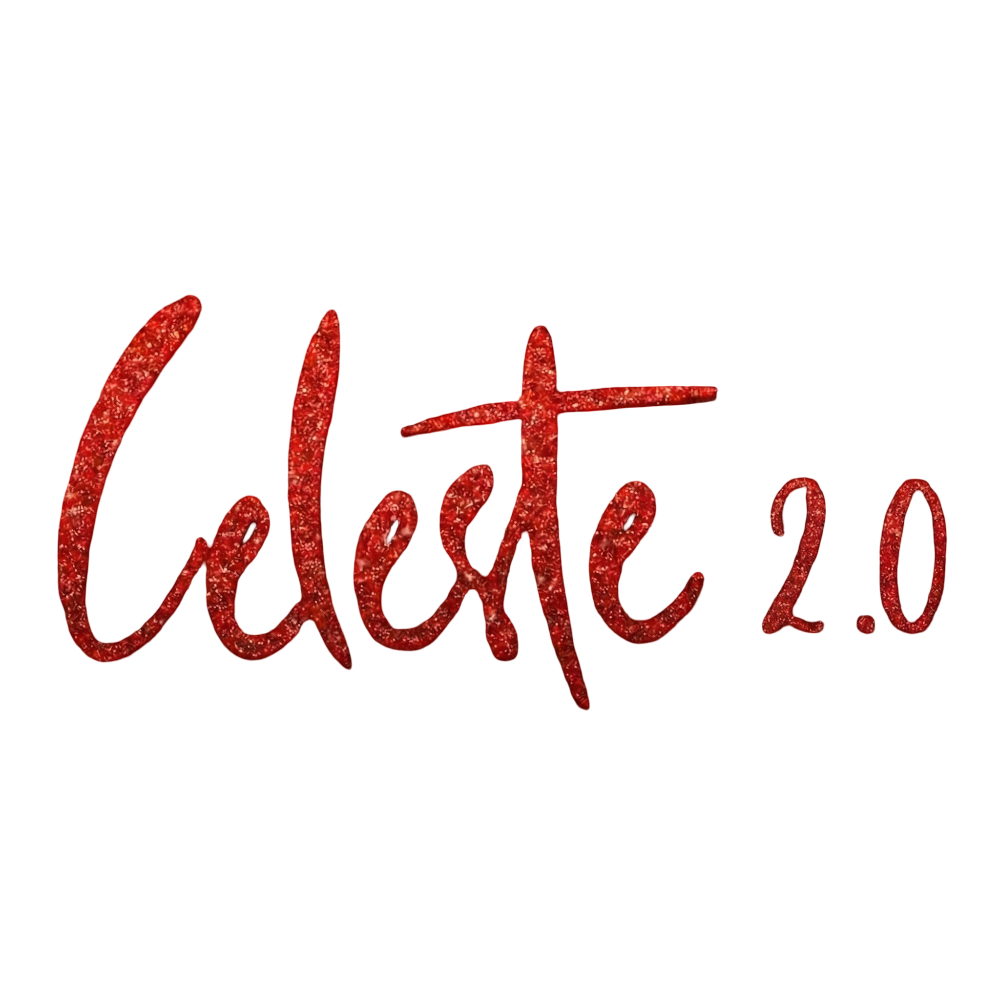

# 🎄 Celeste 2.0 - Christmas Celebration Website

[](https://nextjs.org/)
[](https://reactjs.org/)
[](https://www.typescriptlang.org/)
[](https://tailwindcss.com/)
[](https://www.framer.com/motion/)

A modern, responsive website for **Celeste 2.0**, the Christmas Celebration event organized by Jesus Youth at St. Joseph's College of Engineering and Technology (SJCET), Palai. This website serves as the official platform for event information, competition details, and registration.



## 🌟 Project Overview

Celeste 2.0 is a vibrant Christmas celebration event that brings together the SJCET community to celebrate the joy and spirit of Christmas through various competitions, activities, and fellowship. This website provides comprehensive information about the event and serves as the digital gateway for participants and attendees.

**Event Details:**
- 📅 **Date:** 19th December 2024
- 🕙 **Time:** 10:00 AM – 1:00 PM
- 📍 **Venue:** Center Courtyard, SJCET Palai
- 🎯 **Organizer:** Jesus Youth SJCET

## ✨ Features

- **🏠 Hero Section**: Stunning landing area with event branding and key information
- **📖 About Section**: Detailed event description and objectives
- **🏆 Competitions Section**: Showcase of all four competition categories
- **📞 Contact Section**: Event organizer contact information and support
- **📱 Responsive Design**: Fully optimized for desktop, tablet, and mobile devices
- **🎨 Modern UI/UX**: Beautiful animations and smooth user interactions
- **🎄 Christmas Theme**: Festive color scheme and holiday-inspired design elements

## 🛠️ Tech Stack

### Frontend Framework
- **[Next.js 16.0.10](https://nextjs.org/)** - React framework with App Router
- **[React 19.2.1](https://reactjs.org/)** - UI library
- **[TypeScript 5.x](https://www.typescriptlang.org/)** - Type-safe JavaScript

### Styling & Animation
- **[Tailwind CSS 3.4.19](https://tailwindcss.com/)** - Utility-first CSS framework
- **[Framer Motion 12.23.26](https://www.framer.com/motion/)** - Animation library
- **[PostCSS 8.5.6](https://postcss.org/)** - CSS processing

### UI Components & Icons
- **[Headless UI 2.2.9](https://headlessui.com/)** - Unstyled, accessible components
- **[React Icons 5.5.0](https://react-icons.github.io/react-icons/)** - Popular icon library

### Development Tools
- **[ESLint 9.x](https://eslint.org/)** - Code linting
- **[Autoprefixer](https://autoprefixer.github.io/)** - CSS vendor prefixing

## 📁 Project Structure

```
christmas-celebration-25/
├── app/                          # Next.js App Router
│   ├── favicon.ico              # Site favicon
│   ├── globals.css              # Global styles and Tailwind imports
│   ├── layout.tsx               # Root layout component
│   └── page.tsx                 # Home page
├── components/                   # React components
│   ├── About.tsx                # About section component
│   ├── CompetitionCard.tsx      # Individual competition card
│   ├── Competitions.tsx         # Competitions showcase section
│   ├── Contact.tsx              # Contact information section
│   ├── Footer.tsx               # Site footer with logos
│   ├── Hero.tsx                 # Hero/landing section
│   ├── Navigation.tsx           # Site navigation header
│   ├── RulesModal.tsx          # Competition rules modal
│   └── Schedule.tsx             # Event schedule (if needed)
├── public/                      # Static assets
│   ├── banner.png               # Main event banner
│   ├── celeste.jpeg            # Event branding image
│   ├── jy.png                  # Jesus Youth logo
│   ├── sjcet.png               # SJCET logo
│   └── competition/            # Competition images
│       ├── carol.jpeg          # Christmas Carol competition
│       ├── crib.jpeg           # Crib Making competition
│       ├── fancy_dress.jpeg    # Fancy Dress competition
│       └── santa.jpeg          # Best Santa competition
├── eslint.config.mjs           # ESLint configuration
├── next.config.ts              # Next.js configuration
├── package.json                # Project dependencies
├── postcss.config.js           # PostCSS configuration
├── tailwind.config.js          # Tailwind CSS configuration
├── tsconfig.json               # TypeScript configuration
└── README.md                   # Project documentation
```

## 🚀 Getting Started

### Prerequisites

- **Node.js** (version 18 or higher)
- **npm**, **yarn**, or **pnpm** package manager

### Installation

1. **Clone the repository:**
   ```bash
   git clone https://github.com/dariogeorge21/celeste-2.0.git
   cd christmas-celebration-25
   ```

2. **Install dependencies:**
   ```bash
   npm install
   # or
   yarn install
   # or
   pnpm install
   ```

3. **Run the development server:**
   ```bash
   npm run dev
   # or
   yarn dev
   # or
   pnpm dev
   ```

4. **Open your browser and visit:**
   ```
   http://localhost:3000
   ```

The page will automatically reload when you make changes to the source files.

## 🏗️ Build and Deployment

### Building for Production

```bash
npm run build
# or
yarn build
# or
pnpm build
```

### Running Production Build Locally

```bash
npm run start
# or
yarn start
# or
pnpm start
```

### Deploying to Vercel

The easiest way to deploy your Next.js app is to use the [Vercel Platform](https://vercel.com/new?utm_medium=default-template&filter=next.js&utm_source=create-next-app&utm_campaign=create-next-app-readme).

1. Push your code to a GitHub repository
2. Import your project on Vercel
3. Your app will be automatically deployed on every push to the main branch

## 🏆 Competition Categories

Celeste 2.0 features four exciting competitions:

1. **🎵 Christmas Carol Competition**
   - Showcase your vocal talents with festive songs
   - Traditional and contemporary Christmas carols welcome

2. **🏠 Crib Making Competition**
   - Create artistic nativity scenes
   - Individual and group categories available

3. **🎭 Fancy Dress Competition**
   - Christmas-themed costume contest
   - Creative interpretations encouraged

4. **🎅 Best Santa Competition**
   - Embody the spirit of Santa Claus
   - Judged on costume, performance, and enthusiasm

## 🎄 Event Information

**Celeste 2.0 Christmas Celebration**

- **📅 Date:** December 19th, 2024
- **⏰ Time:** 10:00 AM to 1:00 PM
- **📍 Venue:** Center Courtyard, SJCET Palai
- **🎯 Theme:** Christmas Joy and Fellowship
- **👥 Organizer:** Jesus Youth SJCET
- **🏫 Host Institution:** St. Joseph's College of Engineering and Technology, Palai

## 📞 Contact & Support

For event inquiries, registration assistance, or technical support:

- **Event Organizers:** Jesus Youth SJCET
- **Institution:** St. Joseph's College of Engineering and Technology, Palai
- **Website Issues:** Contact the development team through the repository

## 👨‍💻 Development

### Code Style

This project follows standard React and TypeScript conventions:
- Functional components with TypeScript
- ESLint for code quality
- Tailwind CSS for styling
- Semantic HTML structure

### Contributing

1. Fork the repository
2. Create your feature branch (`git checkout -b feature/amazing-feature`)
3. Commit your changes (`git commit -m 'Add some amazing feature'`)
4. Push to the branch (`git push origin feature/amazing-feature`)
5. Open a Pull Request

## 📄 License

This project is created for the Celeste 2.0 Christmas Celebration event at SJCET Palai.

## 🙏 Credits

**Organized by:** Jesus Youth SJCET  
**Host Institution:** St. Joseph's College of Engineering and Technology, Palai  
**Development:** Built with ❤️ for the SJCET community  

---

**© 2024 SJCET Palai. All rights reserved.**

*May this celebration bring joy, peace, and the true spirit of Christmas to all! 🎄✨*
